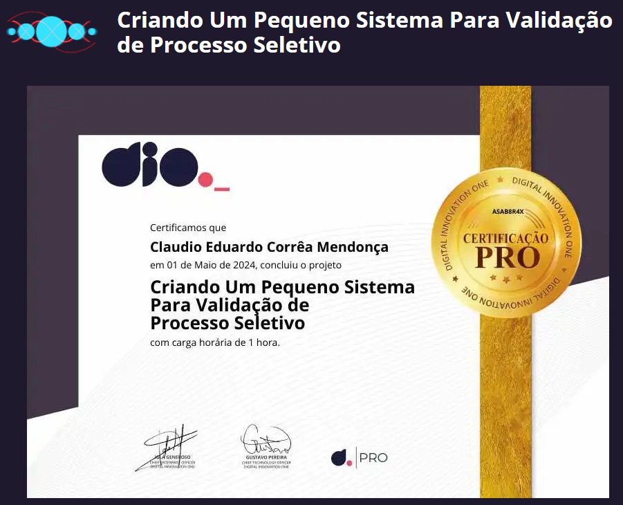

# DIO - Trilha Java Básico - Controle Fluxo


| [](https://dio.me) |
|:--:|
| Trilha de Back-end Java do Santander Bootcamp 2024! Durante este desafio de projeto, explorei vários cenários com fluxos condicionais, repetições e exceções. Ao final, pude exercitar todo o conteúdo ministrado nas aulas implementando um pequeno sistema contador. |
| <a href="https://www.youtube.com/watch?v=wtiaPK_200U" target="_blank"></a> |
| ##Apresentação do Desafio: |
|  |


<a href="https://docs.oracle.com/en/java/javase/20/"></a>


## Índice
<a id="topo"></a>

- [Instrutore](#instrutor)
- [Desafio - Controle de Fluxo](#desafio)
- [Desafio na Prática](#pratica)


## <a name="instrutor"> Instrutore </a>

- [Gleyson Sampaio](https://github.com/glysns)

## <a name="desafio"> Desafio - Controle de Fluxo </a>
### Descrição do instrutor

Vamos exercitar todo o conteúdo apresentado no módulo de Controle de Fluxo codificando o seguinte cenário.

O sistema deverá receber dois parâmetros via terminal que representarão dois números inteiros, com estes dois números você deverá obter a quantidade de interações (for) e realizar a impressão no console (System.out.print) dos números incrementados, exemplo:

* Se você passar os números 12 e 30, logo teremos uma interação (for) com 18 ocorrências para imprimir os números, exemplo: `"Imprimindo o número 1"`, `"Imprimindo o número 2"` e assim por diante.
* Se o primeiro parâmetro for MAIOR que o segundo parâmetro, você deverá lançar a exceção customizada chamada de `ParametrosInvalidosException` com a segunda mensagem: "O segundo parâmetro deve ser maior que o primeiro"   


1. Crie o projeto `DesafioControleFluxo`
2. Dentro do projeto, crie a classe `Contador.java` para realizar toda a codificação do nosso programa.
3. Dentro do projeto, crie a classe `ParametrosInvalidosException` que representará a exceção de negócio no sistema. 

Abaixo temos um trecho de código no qual você poderá seguir alterando as partes que contenham `??`

```java
public class Contador {
	public static void main(String[] args) {
		Scanner terminal = new Scanner(System.in);
		System.out.println("Digite o primeiro parâmetro");
		int parametroUm = terminal.??;
		System.out.println("Digite o segundo parâmetro");
		int parametroDois = terminal.??;
		
		try {
			//chamando o método contendo a lógica de contagem
			contar(parametroUm, parametroDois);
		
		}catch (? exception) {
			//imprimir a mensagem: O segundo parâmetro deve ser maior que o primeiro
		}
		
	}
	static void contar(int parametroUm, int parametroDois ) throws ParametrosInvalidosException {
		//validar se parametroUm é MAIOR que parametroDois e lançar a exceção
		
		int contagem = parametroDois - parametroUm;
		//realizar o for para imprimir os números com base na variável contagem
	}
}
```

<p align="right">
  <a href="#topo" style="text-decoration: none; background-color: #007bff; color: white; padding: 10px 20px; border-radius: 5px;">Voltar ao Topo</a>
</p>
##<a name="pratica"> Desafio na Prática </a>

Durante o curso de Controle de Fluxo, aprendi a criar um programa em Java que recebe dois números inteiros como parâmetros via terminal e realiza uma contagem com base nesses números.

Primeiro, criei um projeto chamado DesafioControleFluxo e duas classes principais: Contador.java e ParametrosInvalidosException.java.

Em Contador.java, desenvolvi a lógica do programa. Utilizei a classe Scanner para receber os parâmetros do usuário e, em seguida, criei uma estrutura try-catch para lidar com a exceção customizada ParametrosInvalidosException, que é lançada quando o primeiro parâmetro é maior que o segundo.

Dentro do método contar(int parametroUm, int parametroDois), validei se o primeiro parâmetro é maior que o segundo. Se não for, lancei a exceção. Caso contrário, realizei a contagem e usei um loop for para imprimir os números incrementados no console.

Esse desafio foi uma ótima oportunidade para aplicar os conceitos de controle de fluxo em Java e entender como lidar com exceções personalizadas. Foi gratificante ver o programa funcionando corretamente e compreender como estruturar e organizar um projeto Java.
<p align="right">
  <a href="#topo" style="text-decoration: none; background-color: #007bff; color: white; padding: 10px 20px; border-radius: 5px;">Voltar ao Topo</a>
</p>

## <a name="certificados"></a>Certificados

- Texto

[](https://www.dio.me/certificate/codigo)


<p align="right">
  <a href="#topo" style="text-decoration: none; background-color: #007bff; color: white; padding: 10px 20px; border-radius: 5px;">Voltar ao Topo</a>
</p>

## <a name="licença"> Licença </a>

<a href="https://www.buymeacoffee.com/claudiomendonca" target="_blank"></a>

Copyright © 2024 <a href="https://www.claudiomendonca.eng.br" target="_blank">ClaudioMendonca.eng.br</a> . 


